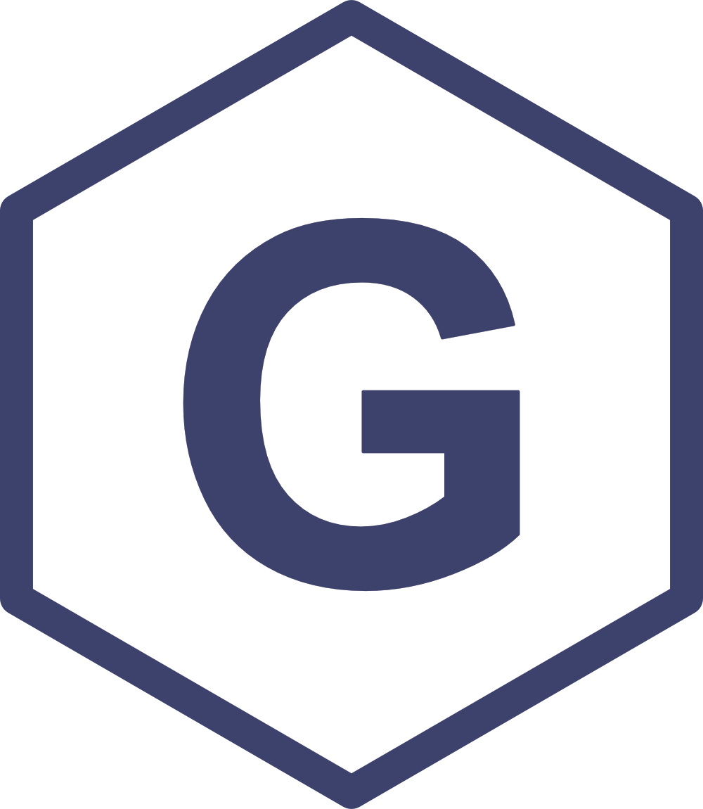

<!--
*** Thanks for checking out the Best-README-Template. If you have a suggestion
*** that would make this better, please fork the repo and create a pull request
*** or simply open an issue with the tag "enhancement".
*** Thanks again! Now go create something AMAZING! :D
-->

<!-- PROJECT SHIELDS -->
<!--
*** I'm using markdown "reference style" links for readability.
*** Reference links are enclosed in brackets [ ] instead of parentheses ( ).
*** See the bottom of this document for the declaration of the reference variables
*** for contributors-url, forks-url, etc. This is an optional, concise syntax you may use.
*** https://www.markdownguide.org/basic-syntax/#reference-style-links
-->

[![LinkedIn][linkedin-shield]][linkedin-url]
[![Website][website-shield]][website-url]

<!-- PROJECT LOGO -->
 

  

  <h3 align="center">Daniel Graham Delafield</h3>

  

    Welcome to my GitHub!
  

<!-- TABLE OF CONTENTS -->

  
Table of Contents

  <ol>
    <li><a href="#about-me">About Me</a> </li>
    <li><a href="#my-current-work">My Current Work</a></li>
    <li><a href="#my-programming-journey">My Programming Journey</a></li>
    <li><a href="#contact-me">Contact Me</a></li>
  </ol>

<!-- ABOUT THE PROJECT -->
## About Me

[![Product Name Screen Shot][product-screenshot]](https://www.lilabs.org/graham-delafield)

I am a developing researcher in the fields of proteomics, bioinformatics, and computer science. Currently I am focused on analytical innovation and computational modeling to aid in the profiling and characterization of the human glycoproteome, performing graduate research at the University of Wisconsin-Madison. Anticipating graduation in May, 2023, I am interested in gaining experience in industrial and governmenta settings that allow me to exercise my technical expertise and strong communication and leadership skills.

<!-- Current Work -->
## My Current Work

Currently I am using various programming languages to build bioinformatic tools to parse and visualize the human proteome.
While most of my work is tailored to work with mass sepctrometry data, I have a vested interest in using programming languages for statistical modeling, data input/transformation/representation, web and web application development.

I am an advanced Python programmer using OOP, scripting, and notebooks for the majority of my work. I am currently developing probablistic coordination tools and convolutional neural networks in medical image analysis. Beyond this, I take every opportunity to practice other programming langauges to diversify my skillset. I never say no to a challenge!

Some tools I currently use are:
* [Python](https://python.org)
* [C](https://www.google.com/search?q=c+language&rlz=1C1CHBF_enUS867US868&oq=c+language&aqs=chrome.0.69i59j0l4j69i60l3.2269j0j4&sourceid=chrome&ie=UTF-8)
* [JavaScript](https://www.javascript.com/)
* [HTML5](https://developer.mozilla.org/en-US/docs/Web/Guide/HTML/HTML5)
* [CSS3](https://jquery.com)
* [Bootstrap](https://getbootstrap.com)
* [JQuery](https://jquery.com)
* [DataTables](https://datatables.net/)

<!-- Programming Journey -->
## My Programming Journey

This is an example of how you may give instructions on setting up your project locally.
To get a local copy up and running follow these simple example steps.

<!-- CONTACT -->
## Contact Me

Graham Delafield - [@DGDelafield](https://twitter.com/DGDelafield) - graham.delafield@gmail.com

<!-- ACKNOWLEDGEMENTS -->
## Acknowledgements
* [GitHub Emoji Cheat Sheet](https://www.webpagefx.com/tools/emoji-cheat-sheet)
* [Img Shields](https://shields.io)
* [Choose an Open Source License](https://choosealicense.com)
* [GitHub Pages](https://pages.github.com)
* [Animate.css](https://daneden.github.io/animate.css)
* [Loaders.css](https://connoratherton.com/loaders)
* [Slick Carousel](https://kenwheeler.github.io/slick)
* [Smooth Scroll](https://github.com/cferdinandi/smooth-scroll)
* [Sticky Kit](http://leafo.net/sticky-kit)
* [JVectorMap](http://jvectormap.com)
* [Font Awesome](https://fontawesome.com)

<!-- MARKDOWN LINKS & IMAGES -->
<!-- https://www.markdownguide.org/basic-syntax/#reference-style-links -->
[contributors-shield]: https://img.shields.io/github/contributors/othneildrew/Best-README-Template.svg?style=for-the-badge
[contributors-url]: https://github.com/othneildrew/Best-README-Template/graphs/contributors
[forks-shield]: https://img.shields.io/github/forks/othneildrew/Best-README-Template.svg?style=for-the-badge
[forks-url]: https://github.com/othneildrew/Best-README-Template/network/members
[stars-shield]: https://img.shields.io/github/stars/othneildrew/Best-README-Template.svg?style=for-the-badge
[stars-url]: https://github.com/othneildrew/Best-README-Template/stargazers
[issues-shield]: https://img.shields.io/github/issues/othneildrew/Best-README-Template.svg?style=for-the-badge
[issues-url]: https://github.com/othneildrew/Best-README-Template/issues
[license-shield]: https://img.shields.io/github/license/othneildrew/Best-README-Template.svg?style=for-the-badge
[license-url]: https://github.com/othneildrew/Best-README-Template/blob/master/LICENSE.txt
[linkedin-shield]: https://img.shields.io/badge/-LinkedIn-black.svg?style=for-the-badge&logo=linkedin&colorB=555
[linkedin-url]: https://www.linkedin.com/in/daniel-delafield-42531871/
[product-screenshot]: images/AtBench.JPG
[website-shield]: https://img.shields.io/website?down_color=lightgrey&down_message=offline&style=for-the-badge&up_color=blue&up_message=online&url=https%3A%2F%2Fwww.grahamdelafield.com
[website-url]: https://www.grahamdelafield.com
